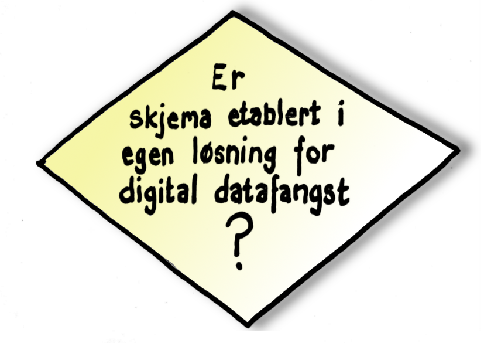

# Karius og Baktus

## 

# Gratis lunsj..?

##

##

# Det e itj'nå som kjæm tå sæ sjøl...

##

## 

# Og, enda en gang

##

##

# Ferdig?

##

##

# Og alle hjerter gleder seg...

##

# Alle sammen sammen

## Men først
en liten [primer](https://www.youtube.com/watch?v=3owNqV-BlfA)

## 

# Finansiering

## Oppgaver, kostnad og finansieringskilde

|Oppgave|Kostnad (kr)|Kilde|
|:---|---:|:---|
|Oppgradering plattform|?|Driftsavtale|
|Etablering av skjema i register|?|Egen/regional/FMK NIKT|
|Etablering av skjema i ePROMS|ca 20 000|Egen|
|Ev lisenser|?|Egen|