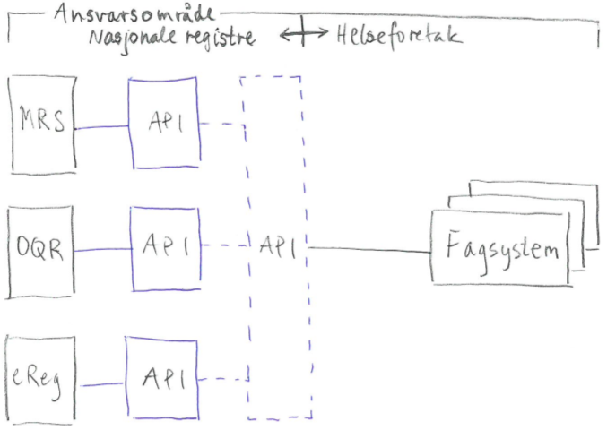

## Hva saken omhandler
Flyt av data mellom fagsystemer og (nasjonale) registre og hvorvidt FMK skal ta på seg en strategisk og aktiv rolle i denne sammenhengen.

## Bakgrunn
Det er stadig aktuelt å etablere sammenkobling mellom fagsystemer og nasjonale registre og det forventes at behovet vil være økende. Hittil har slike sammenkoblinger vært gjort av leverandørene for enkeltregistre og arbeidet er i stor grad foretatt som "punkt-til-punkt" fremfor gjennom en generell og standardisert og dermed en gjenbrukbar tilnærming. FMK har tidligere i forbindelse med sak 68/16 diskutert muligheten for etablering av standardiserte
grenseflater mot de nasjonale løsningen for datafangst slik at vilkårlige fagsystemer kan "koble seg opp mot" nasjonale registre. Daværende leder for FMK Eivind A. Kristiansen laget en skisse på bakgrunn av diskusjonen i FMK. Denne (med tilhørende diskusjon) ble aldri skikkelig referatsført men er etter egen hukommelse forsøkt illustrert i Fig. \ref{api}.

## Utfordring
Det er av stor strategisk betydning å kunne definere et felles og standardisert grensesnitt for datautveksling hos datafangstløsningene som (de nasjonale) kvalitetsregistene benytter. Ved behov for sammenkobling til vilkårlige fagsystem vil registrenes løsninger for datautveksling allerede være klargjort (og dokumentert) og det meste av resterende jobb vil da ligge hos leverandørene av de aktuelle fagsystemene. Den største gevinsten er antatt å være at ansvarsområdene for nasjonale registre versus helseforetakene blir mer tydelig definert. En opplagt følge er da at det økonomiske ansvaret for at register og fagsystem lar seg koble sammen vil tilligge helseforetakene og ikke "kvalitetsregistgersatsningen" med sitt årlige totalbudsjett på skarve 32 mil kr.

Ved en eventuell etablering av et (eller flere) standard grensesnitt for datautveksling så er det antatt at en hovedutfordring vil være omfanget (i tid/penger) ev et slikt prosjekt. Det vil da være viktig med en grundig utredning i forkant av tekniske aspekter (muligheter og begrensninger) og hvilket kostnadsmessig omfang et slik prosjekt kan antas å ha. En annen utfordring er at tiden for å få på plass gode løsninger er begrenset. Behovet for å unngå dobbeltregistrering er "skrikende" og all den tid det ikke finnes gode måter å få til slike sammenkoblinger på, tys det til alle mulige metoder der fellesnevnere ofte er manglende standarder og oppattarbeid noe som på sikt blir både dyrt og dårlig.

## Konklusjon
FMK bør ta opp igjen initiativet slik det ble diskutert i forbindelse med sak 68/16.

## Forslag til vedtak
Utformes i møtet.
